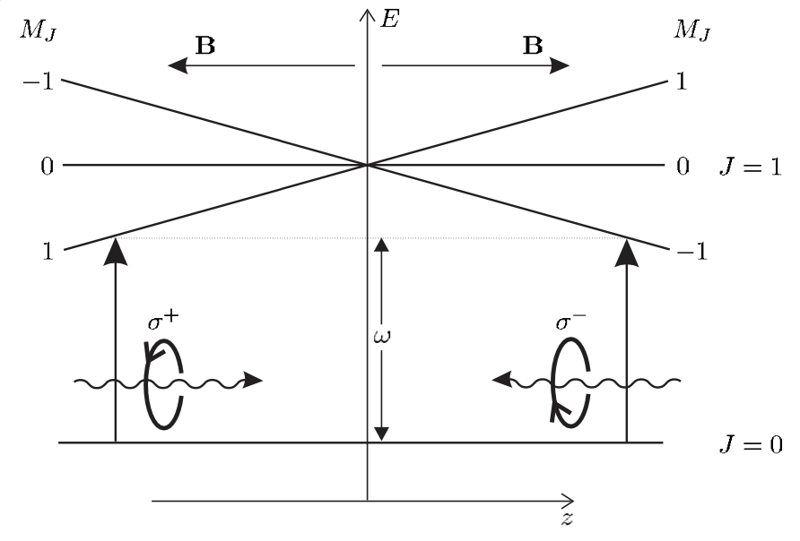

## Magneto-Optical Trap (MOT)

Atoms can be trapped and cooled by lasers with a spatial-and-velocity-selective force. The trap is a field minimum with positiv gradient outside; as atoms traverse space certain states become Zeeman-shifted into resonance with lasers at certain polarizations, and absorption events kick the atom towards the center.

<figure markdown>
  { width="400" }
  Sample MOT with transitions from J=0 to J'=1 in 1D. In the center B=0 and there is no Zeeman shift. To the right the $M_J=-1$ state becomes resonant with the $\sigma^-$ beam. Likewise to the left the $M_J=1$ state becomes resonant with the $\sigma^+$ beam. Note this is in the lab frame with a fixed quantization axis along z and the center is z=0. Because B-field increases positively in either direction, a negative $z < 0 \implies M_J = +1$ goes down in energy. Image from Atomic Physics by C. Foot.
</figure>

## Forces
The forces in 1D are the scattering forces of two opposite-circularly polarized beams with a detuning that is modified by velocity and the spatial gradient:

$$F_{MOT} = F_{sc}^{\sigma^+}(\omega - kv - (\omega_0 + \beta z)) - F_{sc}^{\sigma^-}(\omega + kv - (\omega_0 - \beta z))$$

$$F_{MOT} \approx -2\frac{\partial F}{\partial \omega}kv + 2\frac{\partial F}{\partial \omega_0}\beta z$$

Where in the second line we have assumed that there is a small Zeeman shift $\beta z \ll \Gamma$, implicitly a small velocity approximation $kv \ll \Gamma$, and balanced forces. The term $\omega_0 + \beta z$ is the resonant absorption frequency for the $\Delta M_J=1$ transition at position $z$ and the coefficient $\beta$ is $\frac{g \mu_B}{\hbar}\frac{dB}{dz}$. Here, $g=g_{F'}M_{F'} - g_F M_F$ for a transition between hyperfine levels; like usual we care about the differential Zeeman energy between the involved states.

$F_{MOT}$ depends on the frequency detuning $\delta = \omega - \omega_0$. For small detuning $\omega \approx - \omega_0$ and thus

$$F_{MOT}=-2 \frac{\partial F}{\partial \omega}(kv+\beta z)$$

$$F_{MOT}=-\alpha v - \frac{\alpha \beta}{k}z$$

The bottom line is the most intuitive statement: it is a restoring force that is velocity-and-spatially dependent, with an overdamped condition with spring constant $\frac{\alpha \beta}{k}$.

## Experiment

| Species| Trap | Repump | Acceptable typical power (Trap) | Acceptable typical power (RP) | Beam radius | $I/I_\mathrm{sat}$ per beam (Trap)|Comments
| :--- | :---: | :--- | :---  | :---  | :--- | :--- | :--- 
| **Rb-87** | F=2 to F'=3| F=1 to F'=2 | 300 +/- 5% mW | ~5% of trap |$\sim 2$ cm | $2.3$ |RP intensity is small fraction of Trap; F'=2 and F'=3 are ~260 MHz separated (resolved).
| **K-40** | F=9/2 to F'=11/2 | F=7/2 to F' = 9/2 | 300 +/- 5% mW| ~50(10)% of Trap |$\sim 2$ cm | $2.3$| K-40 has inverted hyperfine so F'=11/2 is lowest energy in F' manifold; F' Zeeman spacing is ~40 MHz or $\sim 7 \Gamma$ (not well resolved) -> RP intensity and force is significant.

