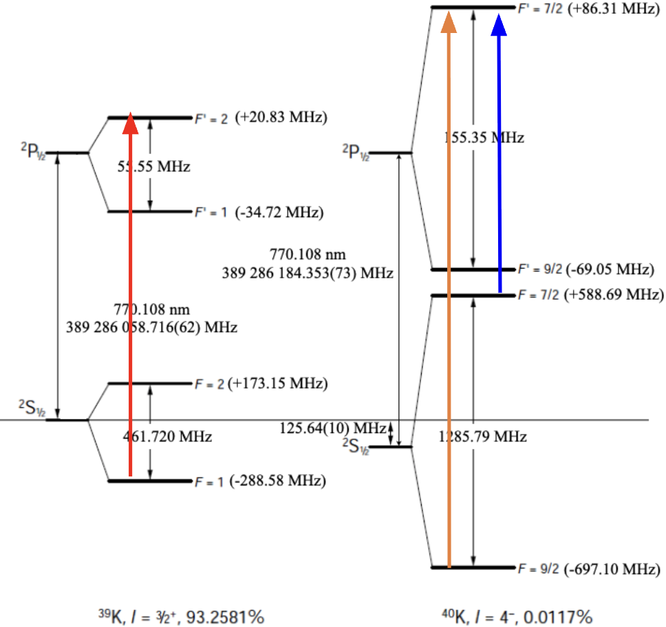
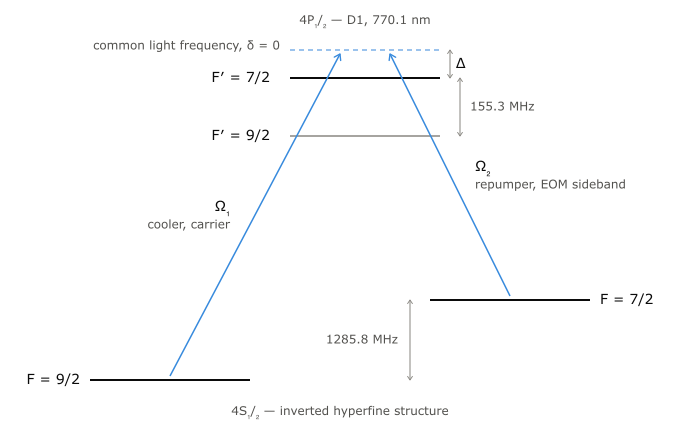

## Context

A type of sub-Doppler cooling that combines a polarization gradient cooling, a two-photon $\Lambda$ transition, and dark-state coupling. Normal PGC is not as effective for the K-40 D2 line compared to Rb-87 because the hyperfine manifold is not as well resolved. Gray molasses cooling on the D1 line is utilized instead.

<figure markdown>
  { width="400" }
  We lock to the F=1 to F'=2 transition of K-39 on the left. On the right for K-40, we utilize F=9/2 to F'=7/2 for the "cooler" leg, and F=7/2 to F'=7/2 for the "repumper" leg.
</figure>

## Bright and dark states

### Setup and Hamiltonians
A simplified diagram of the states involved in the so-called "Lambda" transition is shown below.

<figure markdown>
  { width="400" }
  We will refer to F=9/2 and F=7/2 as ground states one and two -- $\ket{g_1}$ and $\ket{g_2}. The excited state is F'=7/2 or $\ket{e}$.
</figure>

Note that both arms are blue-detuned with common-mode detuning $\Delta>0$. Here the differential is $\delta = \Delta_1 - \Delta_2$ which has been suggestively set to 0. In the semi-classical picture under the RWA, the interaction Hamiltonian is 

$$H_\mathrm{int} = \frac{\hbar}{2} [\Omega_1 e^{-i\omega_1 t} \ket{e}\bra{g_1} + \Omega_2 e^{-i\omega_2 t} \ket{e}\bra{g_2}]$$

where the zero of energy has been set at $\ket{g_1}$, such that $\omega_1 \equiv \omega_{g\to e}$ but $\omega_2 \equiv \omega_{g \to e} - \omega_{hf}$. Here, $\omega_{hf} = 1285.8$ MHz is fixed by our D1 level structure. Let us remove the time dependence by transforming into a rotating frame. That is, we seek to do the transformation 

$$H \to UHU^\dag + i\hbar \dot{U} U^\dag$$

where $U(t)= e^{i\sum_n \theta_n\ket{n}\bra{n}}$ is some unitary operator, that when acting on a state $\ket{\psi} = \sum_n c_n \ket{n}$, transforms $\tilde{c}_n = e^{i\theta_n(t)} c_n$. Since $U$ is diagonal, 

$$U \ket{m} \bra{n} U^\dag = e^{i\theta_m} \ket{m} \bra{n} e^{-i\theta_n} = e^{i(\theta_m - \theta_n)} \ket{m}\bra{n}$$

and therefore we expect to see:

- diagonal terms ($m=n$) will be unchanged
- off-diagonal terms get difference-phase prefactors

Explicitly, the transformation creates

$$
\Omega_1 e^{-i\omega_{L1}t}|e\rangle\langle g_1| \;\longrightarrow\; \Omega_1\,e^{i(\theta_e-\theta_{g_1}-\omega_{L1}t)}|e\rangle\langle g_1|
$$
$$
\Omega_2 e^{-i\omega_{L2}t}|e\rangle\langle g_2| \;\longrightarrow\; \Omega_2\,e^{i(\theta_e-\theta_{g_2}-\omega_{L2}t)}|e\rangle\langle g_2|
$$

Demanding that both exponents vanish (i.e: imposing stacisity) gives

$$
\boxed{\ \theta_e - \theta_{g_1} = \omega_{L1}t, \qquad \theta_e - \theta_{g_2} = \omega_{L2}t\ }
$$

Lastly, we stay consistent with fixing the energy of $\ket{g_1}$ to be zero and do some gauge-fixing by setting $\theta_g \to 0$ as well. The final unitary is

$$
U(t) = \exp\Big(i\big[\omega_{L1}|e\rangle\langle e| + (\omega_{L1}-\omega_{L2})|g_2\rangle\langle g_2|\big]t\Big) \equiv e^{iRt}
$$

## Experiment

- capture velocity is low 
- circ to circ polarization is weird
- optical setup, diagram
- repumper EOM
- blue detuning