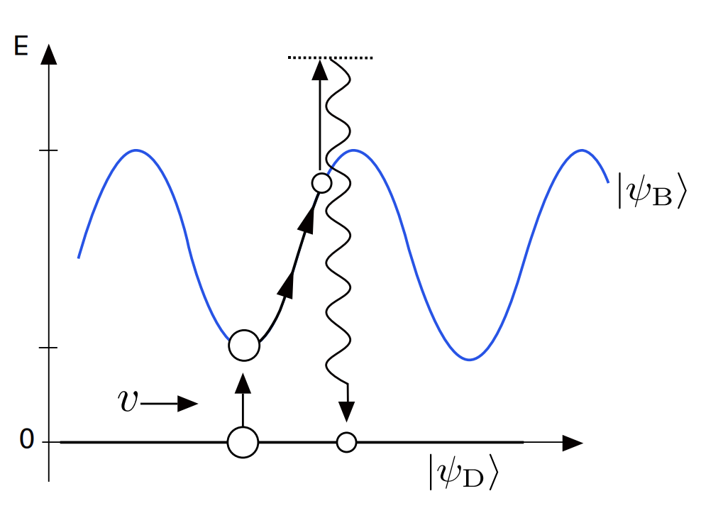

## Context

<figure markdown>
  { width="400" }
  Atoms are in dressed into superpositions of (B)right and (D)ark states. Bright states climb potential hills before getting optically pumped into a dark state. Motional coupling brings dark states back towards bright states near potential valleys. Image taken from Fig. 4.2.1 of Diogo Rio Fernandes' PhD thesis, 2014.
</figure>

A type of sub-Doppler cooling that combines a polarization gradient cooling, a two-photon $\Lambda$ transition, and dark-state coupling. Normal PGC is not as effective for the K-40 D2 line compared to Rb-87 because the hyperfine manifold is not as well resolved. Gray molasses cooling on the D1 line is utilized instead.

<figure markdown>
  { width="400" }
  We lock to the F=1 to F'=2 transition of K-39 on the left. On the right for K-40, we utilize F=9/2 to F'=7/2 for the "cooler" leg, and F=7/2 to F'=7/2 for the "repumper" leg.
</figure>

## Setup and Hamiltonians
A simplified diagram of the states involved in the so-called "Lambda" transition is shown below.

<figure markdown>
  { width="400" }
  We will refer to F=9/2 and F=7/2 as ground states one and two -- $\ket{g_1}$ and $\ket{g_2}$. The excited state is F'=7/2 or $\ket{e}$.
</figure>

Note that both arms are blue-detuned with common-mode detuning $\Delta>0$. Here the differential is $\delta = \Delta_1 - \Delta_2$ which has been suggestively set to 0. In the semi-classical picture under the RWA, the interaction Hamiltonian is 

$$H_\mathrm{int} = \frac{\hbar}{2} [\Omega_1 e^{-i\omega_1 t} \ket{e}\bra{g_1} + \Omega_2 e^{-i\omega_2 t} \ket{e}\bra{g_2}]$$

where the zero of energy has been set at $\ket{g_1}$, such that $\omega_1 \equiv \omega_{g\to e} + \Delta_1$ and $\omega_2 \equiv \omega_{g \to e} + \Delta_2 - \omega_{hf}$. Here, $\omega_{hf} = 1285.8$ MHz is fixed by our D1 level structure. Let us remove the time dependence by transforming into a rotating frame. That is, we seek to do the transformation 

$$H \to UHU^\dag + i\hbar \dot{U} U^\dag$$

where $U(t)= e^{i\sum_n \theta_n\ket{n}\bra{n}}$ is some unitary operator, that when acting on a state $\ket{\psi} = \sum_n c_n \ket{n}$, transforms $\tilde{c}_n = e^{i\theta_n(t)} c_n$. Since $U$ is diagonal, 

$$U \ket{m} \bra{n} U^\dag = e^{i\theta_m} \ket{m} \bra{n} e^{-i\theta_n} = e^{i(\theta_m - \theta_n)} \ket{m}\bra{n}$$

and therefore we expect to see:

- diagonal terms ($m=n$) will be unchanged
- off-diagonal terms get difference-phase prefactors

Explicitly, the transformation creates

$$
\Omega_1 e^{-i\omega_{L1}t}|e\rangle\langle g_1| \;\longrightarrow\; \Omega_1\,e^{i(\theta_e-\theta_{g_1}-\omega_{L1}t)}|e\rangle\langle g_1|
$$

$$
\Omega_2 e^{-i\omega_{L2}t}|e\rangle\langle g_2| \;\longrightarrow\; \Omega_2\,e^{i(\theta_e-\theta_{g_2}-\omega_{L2}t)}|e\rangle\langle g_2|
$$

Demanding that both exponents vanish (i.e: imposing stacisity) gives

$$
\boxed{\ \theta_e - \theta_{g_1} = \omega_{L1}t, \qquad \theta_e - \theta_{g_2} = \omega_{L2}t\ }
$$

Lastly, we stay consistent with fixing the energy of $\ket{g_1}$ to be zero and do some gauge-fixing by setting $\theta_{g_1} \to 0$ as well. This causes $\theta_e = \omega_1 t$ and $\theta_{g_2} = \omega_1 t - \omega_2 t$. The final unitary is

$$
U(t) = \exp\Big(i\big[\omega_{1}|e\rangle\langle e| + (\omega_{1}-\omega_{2})|g_2\rangle\langle g_2|\big]t\Big) \equiv e^{iRt}
$$

Now we perform the transformation. Intuitively, the non-diagonal terms will become stationary. But because $U$ was diagonal and commutes with the bare $H_\mathrm{atom}$, its effect will be to shift the bare atom energies. That is, 

$$
|e\rangle:\quad \hbar\omega_e - \hbar\omega_{1} = -\hbar\Delta_1
$$

$$
|g_2\rangle:\quad \hbar\omega_{\rm hf} - \hbar(\omega_{1}-\omega_{2}) = -\hbar\big[(\omega_{1}-\omega_{2}) - \omega_{\rm hf}\big] = -\hbar\delta
$$

And our final Hamiltonian is

$$
\boxed{\ H = -\hbar\Delta_1|e\rangle\langle e| \;-\; \hbar\delta\,|g_2\rangle\langle g_2|
\;+\; \frac{\hbar}{2}\Big(\Omega_1|e\rangle\langle g_1| + \Omega_2|e\rangle\langle g_2| + \mathrm{h.c.}\Big)\ }
$$

### Interpretation

- The excited-state energy in this rotating frame is just the one-photon detuning.
- The hyperfine splitting has been absorbed; the ground-state spitting depends on the two-photon differential detuning.
- Off-diagonal terms are now stationary states.
- The signs of the energy shifts depend on the definition of $\delta = \Delta_1 - \Delta_2$ in this case.
- When $\delta = 0$, the ground-state splitting disappears; the two ground states become degenerate. This will be shown to be necessary for forming coherent superpositions of bright and dark states.

## Bright and dark states

Note that $\ket{g_1}$ did not disappear, its relevant entries in the Hamiltonian are simply zero. Let us rotate the two ground states into a new basis. Using mixing angle $\tan(\theta) = \Omega_2/\Omega_1$ and generalized Rabi $\Omega = \sqrt{|\Omega_1|^2 + |\Omega_2|^2}$, we can write

$$\ket{B} = \cos(\theta) \ket{g_1} + \sin(\theta) \ket{g_2} = \frac{\Omega_1\ket{g_1} + \Omega_2 \ket{g_2}}{\Omega}$$

$$\ket{D} = \sin (\theta) \ket{g_1} - \cos(\theta) \ket{g_2} = \frac{\Omega_1\ket{g_1} - \Omega_2\ket{g_2}}{\Omega}$$

So we now have bright $\ket{B}$ and dark $\ket{D}$ states that are coherent superpositions of the ground states. This naming reflects the fact that **the dark states have zero coupling with the excited state**:

$$
\bra{e}H\ket{B} = \frac{\hbar (\Omega_1^2 + \Omega_2^2)}{2\Omega}=\frac{\hbar \Omega}{2}, \qquad \bra{e}H\ket{D}= \frac{\hbar (\Omega_1\Omega_2 - \Omega_2\Omega_1)}{2\Omega}=0
$$

Bright and dark states are not stationary; they couple to each other even through the interaction Hamiltonian!

$$\bra{B}H\ket{D} = \hbar \delta \frac{\Omega_1\Omega_2}{\Omega^2}$$

For $\Omega_1 = \Omega_2$, the coupling is $\hbar \delta /2$. Generally speaking, if the matrix element is $\propto \delta$ then the population transfer is $\propto \delta^2$. This means the bright-dark coupling is strongly dependent on the detuning, and also therefore on frequency jitter. It is therefore optimal to produce the two legs of the transition in a way that locks the differential frequency jitter; this can be accomplished by using only one laser but generating the second leg with an EOM rather than using two different lasers. The EOM method is the most common.

### Sisyphus mechanism

Like regular polarization gradient cooling, counterpropagating pairs of orthogonal light produce a spatial polarization gradient. Let us take a far-detuned limit such that $\Delta \gg \Gamma, \Omega$. **Only the bright states experience light shifts, given by**

$$U_B = \frac{\hbar \Omega^2}{4\Delta}$$

**We want to use blue-detuned lasers so that $\Delta > 0$ and $U_B>0$. The dark states sit below in energy compared to the bright states!**

Similar to PGC, atoms in bright states must climb some potential hill before getting optically pumped to a dark state. How do dark states transform back into bright states to keep this going?

### Motional coupling 

I skip only to the final result. The coupling to the momentum operator is 

$$\bra{B}\frac{\hat{p}}{2m}\ket{D} = -\frac{2\Omega_1\Omega_2}{\Omega^2} \hbar k v$$

Fermi's golden rule for transitions between dark and bright states takes the square of the matrix element, so $\Gamma \propto (kv)^2$. Then, the dark state lifetime is $\tau \propto 1/(kv)^2$. This increases with lower velocity and decreases with higher velocity -- cold atoms accumulate in the dark state and hotter atoms quickly become bright, which enables access to the Sisyphus mechanism.

## Experiment

### Apparatus 

We have a Toptica laser tuned to the D1 line (~770 nm), locked via sat spec to the F=1 to F'=2 transition. The beam goes through a single-pass AOM to set the common-mode detuning (in conjunction with the lock AOM) and fed into an EOM that creates sidebands at 1258.8 MHz. The intensity of these sidebands should be about 5 to 10 % of the carrier and can be adjusted through the EOM driver manually. The frequency can also be adjusted manually, which here amounts to tuning $\delta$. The carrier+sidebands are amplified on a Toptica Eagleyard tapered amplifier, beam shaped, and fiber coupled to the table.

Approximately 200 mW reaches the table, depending on TA current. The beam is split 6 ways through PBS cubes and sent to combine with the MOT beams on the other available input port of the large PBS cubes. 

The D1 beams are much smaller than the MOT at 1" diameter. All optics used are the standard 1" size as well. This allows highly efficient power delivery for D1 cooling but requires careful and sensitive alignment to the MOT.

### General method

After the MOT and CMOT stages, the magnetic fields are switched off and ~7 ms of PGC and gray molasses follows. The gray molasses intensity is controlled by the initial AOM amplitude, which is constant for 4 ms and ramps down linearly in the last 2 ms to roughly 40%.

### Alignment notes

#### D1 working but needs to be optimized
 - Alignment. Random walk the various mirrors and look for improvement in the PSD or temperature post-gray molasses.
 - Differential detuning. Scan $\delta$ through the EOM driver's frequency. Look for characteristic asymmetric heating/cooling curve.
 - Sideband power. Scan EOM driver's amplitude.
 - Mode instability. Use Fabry-Perot to look for mode stability. If unstable, usually because of laser mode hop; often need to play with current and temperature.

 #### D1 is physically aligned by eye but not really working

 - Improve alignment with push test. Block all beams but one, and turn on D1 beams near end of MOT for 10's of ms before imaging. Should notice a clear displacement of MOT in expected direction. Adjust mirrors to maximize displacement -- this should be when beam is most centered on MOT. Repeat for all 6 beams.
- Check for other settings described in previous subsection.

#### D1 is not aligned at all and MOT works.

- Walk mirrors until D1 is aligned in the forward sense to the MOT beams.
- Have a friend look on the other side and tell you if the D1 counterpropagating pairs are overlapped or not. Walk mirrors until overlap is maximized on both sides of the chamber, near and far.

## Sources

- Diogo Rio Fernandes. PhD thesis, 2014.
- Daniel Steck. Quantum and Atom Optics. Teaching notes, 2007. Accessed online.
- Wikipedia. Unitary transformation (quantum mechanics).