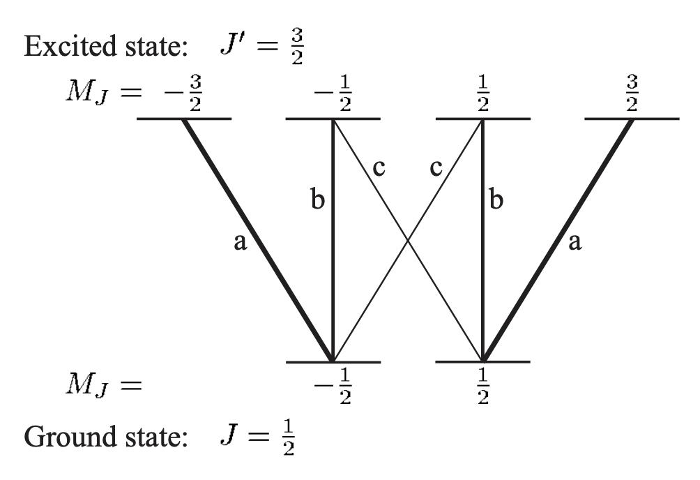
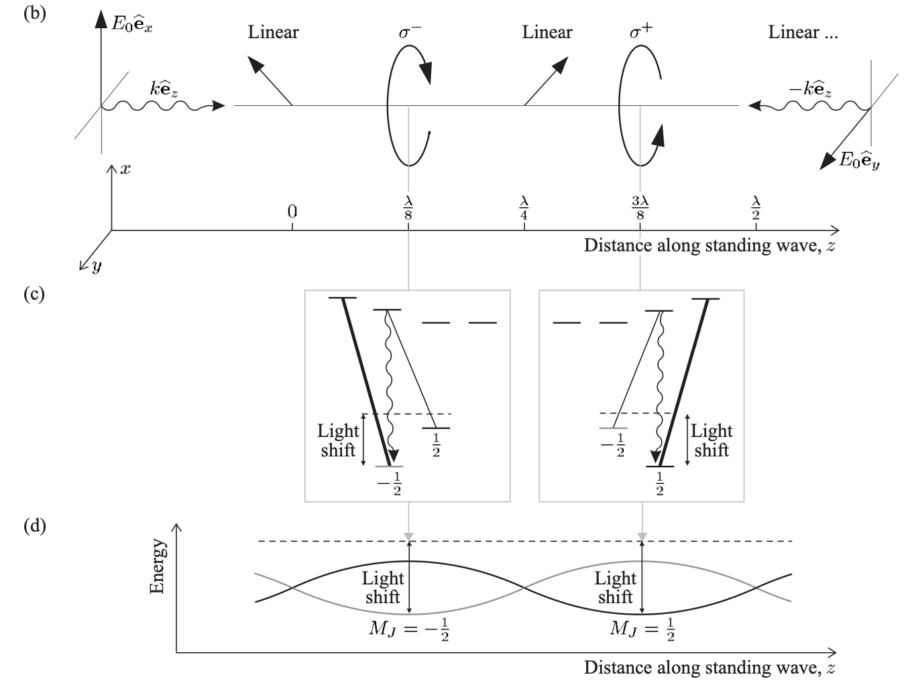

## Context

The Doppler limit is set by an atom's linewidth $\Gamma$. This can be beaten by a cooling mechanism set by the scale of the light shifts $U_0$ felt by atoms in a particular electric field.

## Polarization gradient (lin $\perp$ lin)
Consider counterpropagating beams in a lin $\perp$ lin configuration, 

$$E(z) = E_0 (e^{ikz}\hat{e}_x + e^{-ikz}\hat{e}_y)$$

Expanding into sines and cosines and using the circular basis $\hat{e}_{\pm} = \mp (\hat{e}_x \pm i\hat{e}_y) / \sqrt{2}$, one can show that 

$$E(z) \propto E_0 (\cos(kz)\hat{e}_- - i\sin(kz)\hat{e}_+)$$

- When $kz=0$, the field is left-circular
- When $kz=\pi/4$, the field is linear
- When $kz = \pi/2$, the field is right-circular.

We have a spatial polarization gradient that twists like a helix through space, with period $\lambda/2$.

## Clebsch-Gordon coefficients in a toy model

We consider a toy model J=1/2 to J'=3/2. Let us first establish some intuition:

- Relative transition strengths are purely a geometric (Clebsch-Gordon) coefficient. This can be calculated analytically from Wigner-Eckart Theorem, or argued from a sum rule perspective.
- Coupling strengths are directly related to both transition rate and the amplitude of light shifts (AC Stark shifts).
- **Differential light shifts between states, optically pumped with some preferred polarization, can provide the energy imbalance needed for net cooling.**

What are the CG coefficients of our toy model?

<figure markdown>
  { width="400" }
  Sum rule: the sum of the intensities
from each of the upper states is the
same: a = b + c. If the states of
the upper level are equally populated
the atom is rotationally invariant and radiation is symmetric completely symmetric. Since the $\sigma^+$ and $\pi$ decay channels must be the same, we have a+c = 2b. We now have two
simultaneous equations whose solution
is b= 2/3a and c= 1/3a,so the relative
intensities are a : b : c = 3 : 2 : 1. Image and caption modified from Atomic Physics by C. Foot.
</figure>

Summarizing this info in a table:

| Ground state | σ⁻ (q = -1) | π (q = 0) | σ⁺ (q = +1) | Sum |
| --- | --- | --- | --- | --- |
| m = -1/2 | **1** → m' = -3/2 | **2/3** → m' = -1/2 | **1/3** → m' = +1/2 | 2 |
| m = +1/2 | **1/3** → m' = -1/2 | **2/3** → m' = +1/2 | **1** → m' = +3/2 | 2 |

## Differential light shifts

Light shifts follow the expression

$$U_0 = \frac{\hbar \Omega^2}{4 \delta}$$

where $\Omega^2$ is the coupling strength proportional to light intensity and **dependent on the CG coefficients of the exact transition being considered**, and $\delta$ is the detuning of the light. Since the CG coefficients for $\sigma^{\pm}$ light are not the same, and the polarization varies spatially, then at certain places in space the atom will see pure $\sigma^{\pm}$ light and engage in an optical pumping process that ultimately dissipates energy.

<figure markdown>
  { width="400" }
  (b) Polarization gradient from lin $\perp$ lin counterpropagating beams. (c) For $\sigma^{\pm}$ light, atoms are opticaly pumped in such a way as to lose energy, because of differential light shifts on the $m_J$ sublevels. (d) The light shift varies spatially. The state being pumped has climbed a potential hill only to be pumped to a potential valley, ultimately losing energy. Image and caption modified from Atomic Physics by C. Foot.
</figure>

The energy dissipation can persist until atoms can no longer climb potential hills. Therefore the temperature minimum is set by $U_0$, meaning the limit is approximately

$$k_BT \propto U_0 \propto \frac{I}{|\delta|}$$

## Pumping time and capture velocity

How much time does the atom spend climbing the potential hill before getting pumped? If the modified scattering rate is 

$$\Gamma' = \Gamma \frac{\Omega^2}{4\delta^2}$$

then the pumping interval is $\tau \approx 1/\Gamma'$. If $kv \gg \Gamma'$ then the atom is moving fast enough to average over several potential hills before getting pumped and effectively sees no effect. The capture velocity can be compared to this as 

$$v_c \propto \frac{\Gamma'}{k} \propto \frac{\Omega^2}{\delta^2} \propto \frac{I}{\delta^2}$$

## Mysterious caveats I ignore for now

Everything has assumed lin $\perp$ lin configuration. Actually, we use a $\sigma^+$ - $\sigma^-$ configuration in experiment. **The resulting polarization gradient is non-trivially different and the mechanism described here is not really correct at all. The end result of net cooling is about the same however.**

Of course, our light is not perfectly $\sigma$ so actually both configurations exist simultaneously. 

## Important notes for implementation

- $\delta$ should be negative (red detuning) so that the stretched states have lower energy with respect to the non-stretched ones, thereby enabling cooling. Blue detuning would be heating. Gray molasses actually uses blue detuning, but there is another mechanism involved there.
- The capture velocity for PGC is much lower than a MOT, therefore the atoms must be pre-cooled before PGC.
- Very sensitive to magnetic fields because the size of the light shifts is small compared to Zeeman shifts. Efficiency of effect strongly wants zeroed field.

## Experiment

- After our MOT stage we perform optical molasses with Rb-87, but note that this is actually a form of PGC cooling (makes sense because we routinely cool to a fraction of the Doppler temperature).
- The bias coils should be set to zero the field. Since PGC temperature floor is very sensitive to this, minimizing temperature is a proxy for zeroing the field.
- For K, we do a variation of PGC called gray molasses. 

