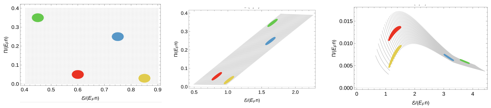

Heller and Werthmann, Experimentally accessible drive-induced attractor in a Fermi gas about unitarity. Accessed at https://arxiv.org/pdf/2507.02838v3. 2026.

## Two-line summary

When a near-unitary Fermi gas is driven by a rapid change in scattering length, early-time relaxation shows common reduction ("memory loss") in the energy-bulk-pressure state space. This is linked to the hydrodynamic attractor of high-energy nuclear physics and heavy ion collisions. 

## Concepts

### Hydrodynamization vs. Local Equilibriation

Local equilibration refers to the expectation value of
the stress-energy tensor being well-described by ideal hydrodynamics, with small dissipative gradient corrections.

Hydrodynamization needs the expectation value of the stress-energy tensor is be well-described by hydrodynamic constitutive relations, even if the viscous corrections to the ideal flow behavior are not small, and the state is not locally equilibrated in the stronger sense. Another perspective: hydrodynamics requires some coherent long-order collective behavior.

Against classical expectations, some classes of initial conditions show hydrodynamization before local equilibration. Therefore one concludes that hydrodynamization is a dynamical
phenomenon distinct from local equilibration and isotropization.

### Attractorization

Reduced sensitivity to some directions in the initial condition space, so that the effective evolution is over a reduced dimensional structure of observables.

## Energy-bulk-pressure coupling in a two-component Fermi gas

The bulk pressure obeys 

$$\tau_\Pi \dot{\Pi} = - \Pi - \zeta (3 a(t) \partial_t a^{-1}(t)$$

But Tan's contact already relates energy density with the time-change of scattering length,

$$\dot{\mathcal{E}} = -\frac{C(t)}{4\pi m} \partial_t a^{-1}$$

So there is coupling between $\Pi$ and $\mathcal{E}$. We seek to explore this evolution in a drive-dominated regime (before onset of relaxation).

## Sweep of $k_Fa$ and time-independence

In a drive-dominated regime where $t_\mathrm{sweep} \ll \tau_\mathrm{relaxation}$, or in other words $|\dot{u}| = k_F|\partial_t a^{-1}| \gg \tau_\Pi^{-1}$, all time dependence drops out and is replaced by magnitude of $|\dot{u}|$.

## Proposed observation

Plot variance ratio of $\Pi$ and $\mathcal{E}$ over range of initial conditions and show dimensional reduction. 

<figure markdown>
  { width="800" }
  Dimensional reduction manifests as significant change in variance ratio of the energy-bulk-pressure coupled state space.
</figure>

### Experiment
1) Start on slightly repulsive side of unitarity.
2) Quickly ramp $u$.
3) Prove $C$ with fast time-resolved measurement (i.e: dimer).
4) Extract $\Pi$ from following relation (assumes previous measurement of $C_{eq}$) 
$$\Pi (t) = \frac{C(t) - C_{eq}(\theta(t))}{12\pi m a(t)}$$
5) Extract $\mathcal{E}$ from integration of $C(t)$ over many measurements.
6) Determine evolution over many initial conditions

### Requirements and notes

- Sweeps begin and end monotonically with $a>0$
- Relevant hierarchy for drive speed is $\tau_\Pi \dot{u} \sim k_F^{-3} \sim E_F^{-3/2}$
- Theory asks for homogeneous density
- high $k_F$ hurts scaling for ramp
- How much ramp can we achieve with the chip wire?

$E_F \sim h\times 16$ kHz with typical trap, and $k_F^{-1} \approx 1680 a_0$. Ramp rate over field is $d|k_Fa|^{-1} / dB \approx 1.3 G^{-1}$. (This is 4 times smaller than their proposal using a $E_F = 1$ kHz). 

What is our slew rate? I know we were able to achieve 1 MHz drives implying period of 1 us; B-field ampltiude about 100 mG (not upper bound); peak-to-peak is then 200 mG. This implies field slew of $>200 G/ms$. (NEED TO VERIFY). So then $|\dot{u}| = \partial_t |k_Fa|^{-1} \sim 260$ kHz. This is about a factor of 2 lower than their proposed numbers but may be within the drive limit as $|\dot{u}| \sim 9 \tau_\Pi^{-1}$.

  
